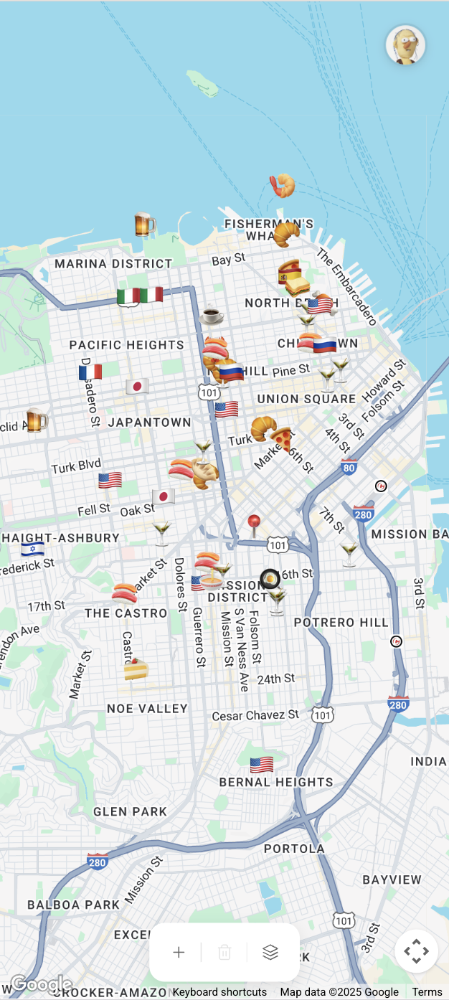
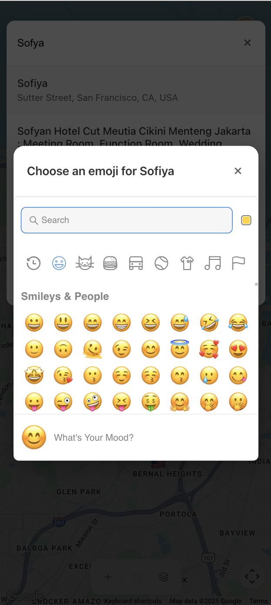
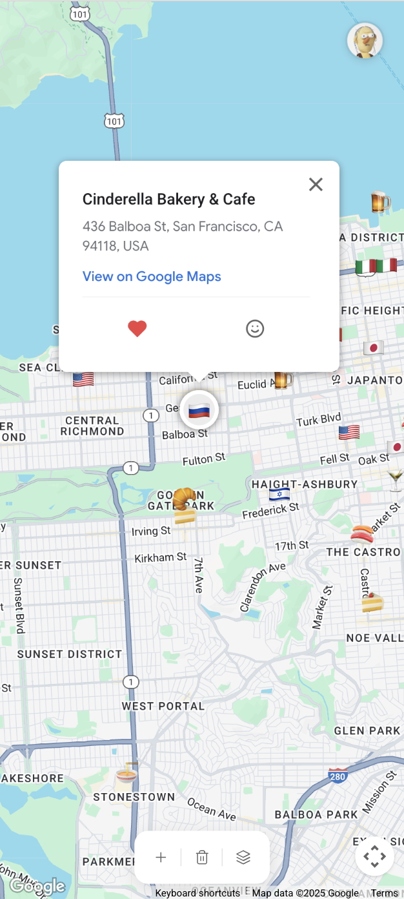

# Places App

A mobile-friendly web app for managing places on a map with emoji markers, similar to Google MyMaps.

<p align="center">
  
  
  
</p>

## Quick Start

1. Clone the repository and install dependencies:
   ```bash
   pnpm install
   ```

2. Get a Google Maps API key from [Google Cloud Console](https://console.cloud.google.com/) (enable Maps JavaScript API and Places API)

3. Create a `.env` file and add your variables and keys for Firebase and Google Maps:
   ```bash
   REACT_APP_GOOGLE_MAPS_API_KEY=
   REACT_APP_GOOGLE_MAP_ID=
   REACT_APP_FIREBASE_API_KEY=
   REACT_APP_FIREBASE_AUTH_DOMAIN=
   REACT_APP_FIREBASE_PROJECT_ID=
   REACT_APP_FIREBASE_STORAGE_BUCKET=
   REACT_APP_FIREBASE_MESSAGING_SENDER_ID=
   REACT_APP_FIREBASE_APP_ID=
   ```

4. Start the app:
   ```bash
   pnpm start
   ```
